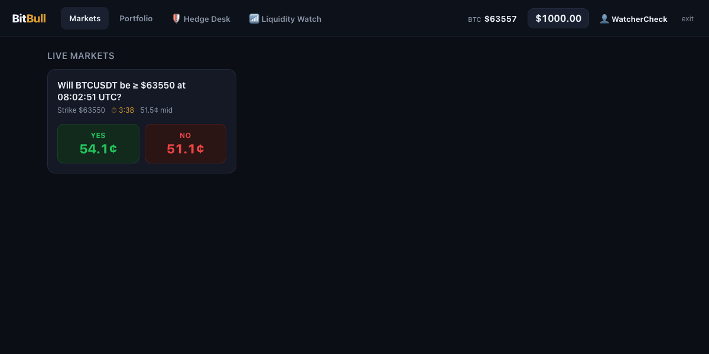
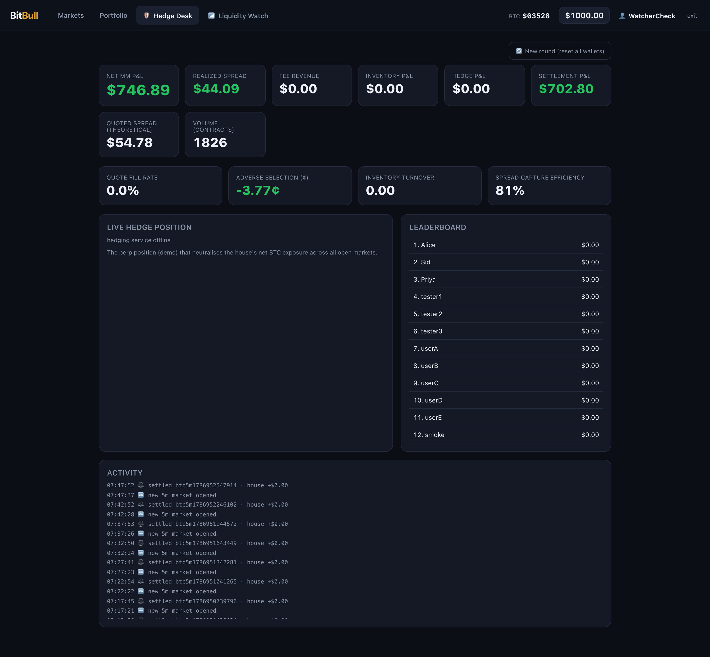
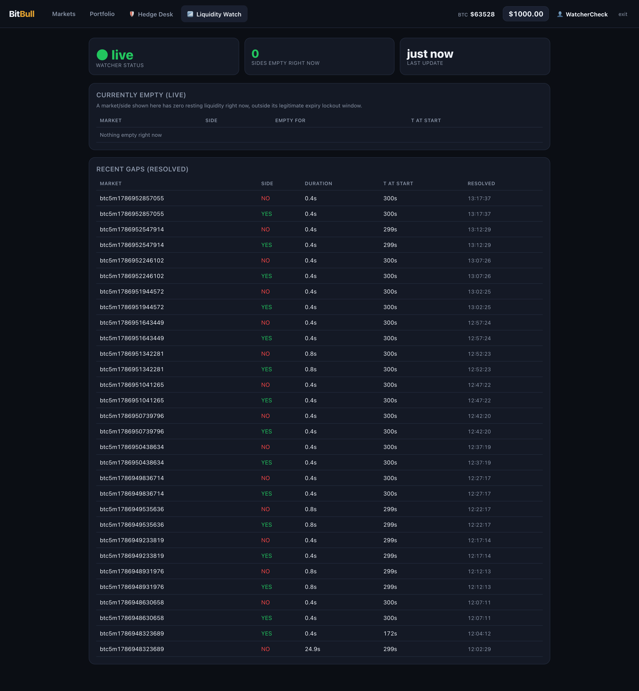
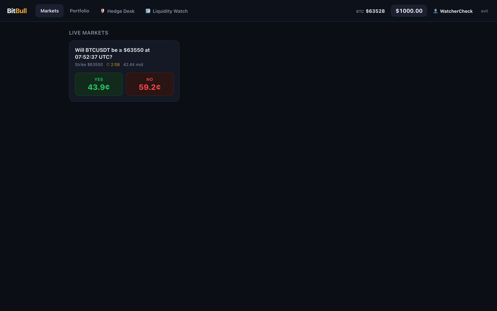
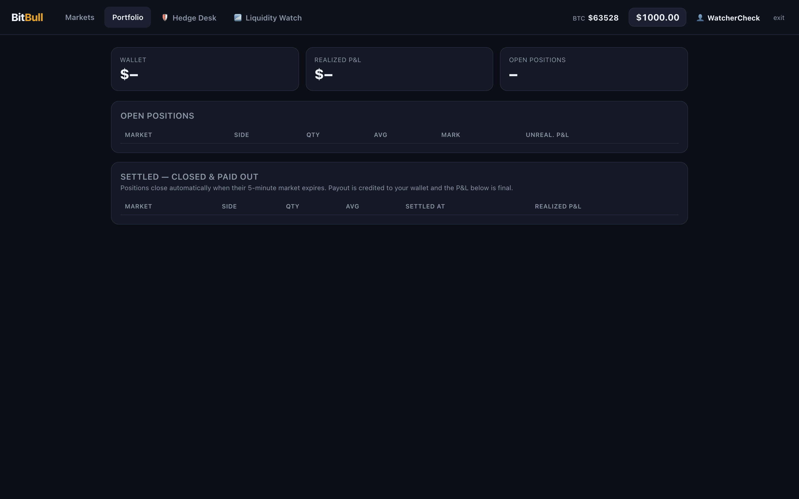

# BitBull — a working prediction-market exchange for 5-minute BTC options

**"Will BTC be ≥ $63,550 at 07:52 UTC?"** — a market that opens, takes real
orders from real people, and settles five minutes later. The house quotes both
sides, so it is the counterparty to everything: it carries genuine directional
inventory risk, and every hard problem in this repo follows from that one fact.

This runs the platform's **real, unmodified production services** — order
validation, matching, settlement and payout are all production code — against a
local Docker stack. The market maker, the pricing curve, the risk instrumentation
and the hedging integration are what I built around them.

<p align="center">
  
</p>

<p align="center"><em>A live 5-minute market. The house requotes continuously off the Binance feed; the countdown ends in settlement and a fresh market opens.</em></p>

---

## The problem this is really about

An order-book exchange matches buyers to sellers and takes a fee. It has no
position. **A prediction market with a house maker is not that** — when the crowd
buys YES, the house is short YES, and it now owns a directional bet on Bitcoin it
never wanted.

Three things follow, and they're what the repo is actually for:

1. **Pricing.** What is a 5-minute binary worth, and does Black-Scholes describe
   a market where τ is measured in seconds?
2. **Quoting.** How wide, and how asymmetric, given the inventory you're already
   holding?
3. **Hedging.** Can that inventory risk be neutralised on perps — and does the
   hedge cost less than the risk it removes?

---

## The MM desk



The operator's view of the house book, decomposed so the P&L is attributable
rather than a single number:

| Metric | Why it's there |
|---|---|
| **Realized spread** vs **quoted spread** | what the vig *theoretically* earns ($54.78) against what actually stuck ($44.09) — the gap is adverse selection |
| **Adverse selection (¢)** | −3.77¢: how much the fills moved against the house right after trading |
| **Spread capture efficiency** | 81% — the single number for "is the quoting working" |
| **Inventory / hedge / settlement P&L** | split out, because a profitable book with a losing hedge is a different problem from the reverse |

Splitting realized from quoted spread is the point. A maker that looks profitable
on quoted spread can be losing steadily to informed flow, and only the difference
between those two numbers shows it.

## Liquidity instrumentation, built after an incident



A market with no resting quote on one side is invisible in aggregate P&L and
obvious to a user who wants to trade. After a production incident where markets
went one-sided, this watcher polls every 400 ms and records **every gap**: which
market, which side, how long, and how much time was left when it started.

The tail is the interesting part. Typical gaps are **0.4–0.8s** — a requote
round-trip, unavoidable. The **24.9s** outlier is a real failure, and having it
recorded with `t at start` is what makes it diagnosable rather than folklore.
It also appears as a live tab in the app, so it's operational, not just a log.

## The rest of the app

<p align="center">
  
  
</p>

Multi-user: everyone gets a name and $1,000, trades against the house maker and
each other, and settles on the same clock. It was built to be used by a room full
of people at once, which is a much better test of a matching path than a script.

---

## How it fits together

```
  BitBull web app  (:5050)   Markets · Portfolio · Hedge Desk · Liquidity Watch
        │
  app/server.mjs             order entry · portfolio · settlement · P&L
        │  place bid
        ▼
  trading-api :8080  ──►  DynamoDB bb_pending_bids            [production, unmodified]
        │                       ▲
        │ SQS                   │ matchedBidsCount
        ▼                       │
  sqs-bridge  ──►  matching-engine :7001  ──►  MySQL order books   [unmodified]
                                              Redis LMSR state
        │ at expiry
        ▼
  distribution-engine :3010  ──►  wallet-stub :3000  ──►  bb_users   [unmodified]

  inventory-mirror  ──►  Redis MMP_LMSR_QUANTITY_*  ──►  hedging-service :8790
                                                              └──►  Binance demo
```

The **only** substituted component on the order path is `sqs-bridge`, because the
production service derives its request host from the queue URL. Everything that
validates, matches, settles or pays out is production code — which is the whole
point: results measured here mean something for the real system.

### What I built

| Driver | Role |
|---|---|
| `mmp-pricing` | the house market maker — persistent worker, event-driven requoting |
| `market-generator` | rolling ATM markets; tenor via `TENOR_MIN` (5m / 15m / 1h) |
| `oracle-feed` | Binance WS → Redis spot, plus an unthrottled tick pub/sub channel |
| `inventory-mirror` | house net inventory → the Redis keys the hedging sidecar reads |
| `liquidity-watcher` | the 400 ms diagnostic above |
| `sqs-bridge` · `wallet-stub` · `secrets-stub` | the three substituted seams |

Shared libraries in `drivers/lib/`: `pricing.mjs` (fair value) ·
`quoting.mjs` (Stoikov + gamma/inventory/flow widening) · `risk.mjs` ·
`matching.mjs` · `fees.mjs` · `flow.mjs`

---

## Running it

Needs Docker.

```bash
cp run/services.env.example run/services.env
docker compose up -d                 # redis · mysql8 · dynamodb-local · elasticmq · postgres
node setup/create-schema.mjs         # idempotent bootstrap — creates every table/schema
node app/server.mjs                  # :5050 — also spawns the persistent quoter
```

```bash
node drivers/oracle-feed/index.mjs           # spot feed (required)
node drivers/sqs-bridge/index.mjs            # order ingress
node drivers/inventory-mirror/index.mjs --watch
node drivers/liquidity-watcher/index.mjs     # optional diagnostics
```

The hedging sidecar is a separate service — see
**[Hedging](https://github.com/sidjainnn/Hedging)**, which reads this stack's
inventory read-only and neutralises it on Binance perps.

### What you need beyond this repo

Everything needed to recreate the **infrastructure** is here: `docker-compose.yml`
pulls its images (redis · mysql8 · dynamodb-local · elasticmq · postgres) from
public registries, `localstack/elasticmq.conf` configures the queues, and
`setup/create-schema.mjs` bootstraps every table and schema from scratch. Container
volumes are deliberately *not* in git — they're regenerable state, and they hold
user rows.

What a clean clone **cannot** get from here are the four production Predictor
services on the order path. They live in their own repositories:

| Service | Port | Role |
|---|---|---|
| trading-api | 8080 | order validation and intake |
| matching-engine | 7001 | order books, matching, LMSR state |
| distribution-engine | 7002 | settlement and payout |
| wallet | 3000 | balances (a stub lives here; accounting is genuine) |

Start those, point `run/services.env` at them, and the stack runs end to end.
Without them the app boots and quotes, but nothing matches — that seam is the
whole reason this repo exists, and vendoring their source into it would defeat
the point of testing against unmodified production code.

## Deeper reading

| Doc | What's in it |
|---|---|
| **[`docs/BitBull-System-Architecture.pdf`](docs/BitBull-System-Architecture.pdf)** | the full ~47pp record: architecture, pricing maths, the gamma wall, hedging, negative results, and the engineering history with root causes |
| [`docs/pricing-and-quoting.md`](docs/pricing-and-quoting.md) | the empirical curve and the quoting overlay |
| [`docs/gamma-hedging-plan.md`](docs/gamma-hedging-plan.md) | what a linear perp can and cannot hedge near expiry |
| [`contracts.md`](contracts.md) | the integration seams and their contracts |

### Related

| Repo | What it is |
|---|---|
| [Hedging](https://github.com/sidjainnn/Hedging) | the read-only perp-hedging sidecar this stack feeds |
| [Kronos-Price-Discovery](https://github.com/sidjainnn/Kronos-Price-Discovery) | can a learned model beat the pricing curve running here? |
| [AMM_Hedging](https://github.com/sidjainnn/AMM_Hedging) | the research simulator where the hedging results were derived |

No real money anywhere: the exchange is local and play-money, and the hedge runs
against the Binance **demo** venue.
